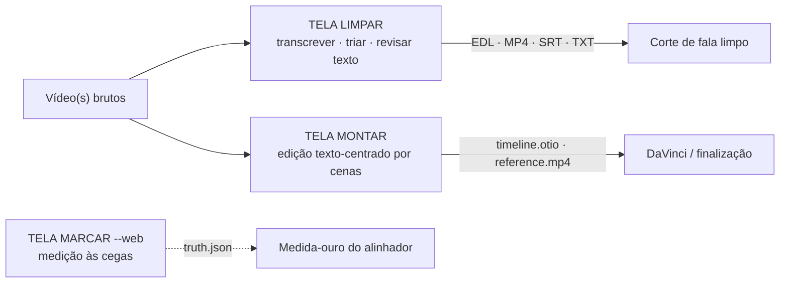
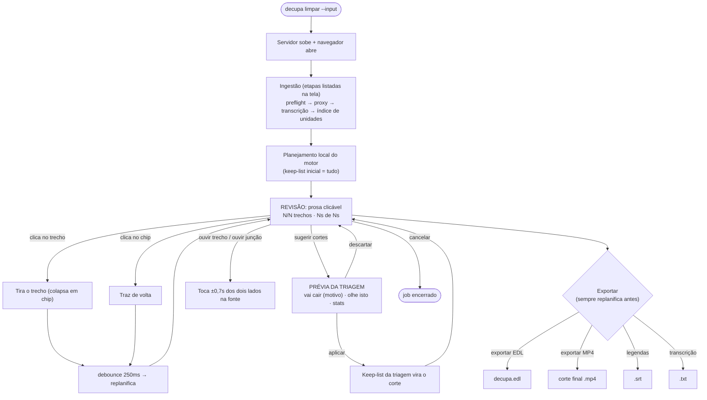
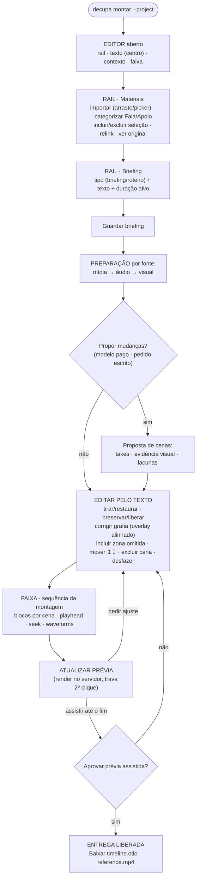
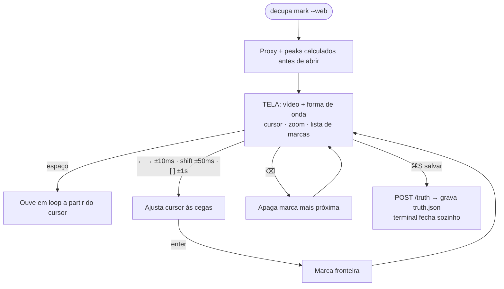

# decupa · jornada do usuário por tela

Fluxogramas derivados do código (server.ts, editor/*.js, mark-web/server.ts).
Visualizável em `work/ui-screens/fluxograma.html` (ou colar os blocos Mermaid
abaixo em qualquer renderizador — GitHub renderiza direto).

## Jornada macro

## 1 · Limpar fala — `decupa limpar --input vídeo.mp4`

## 2 · Montagem — `decupa montar --project dir`

Notas: a correção de grafia vai a `pending` e o servidor a alinha sozinho
(`aligned`) sem nova ASR; a entrega é duplamente travada — UI exige assistir a
prévia até o fim e o servidor recusa export sem aprovação (`exportApproved`).

## 3 · Marcar fronteiras — `decupa mark --web --input áudio --out truth.json`

Nota: a tela nunca mostra transcrição nem predição — só vídeo e onda, para não
invalidar a medição do alinhador.
